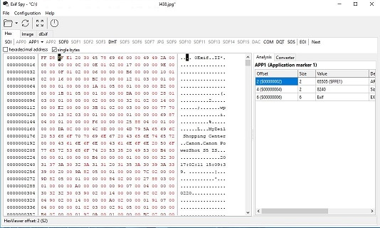

# ExifSpy

<b>ExifSpy</b> ist ein Werkzeug um in die Strukturen von JPEG und EXIF hineinzusehen. Es ist jetzt ein eigenständiges Programm und kann auf  https://github.com/wp-xyz/exif_spy gefunden werden.  

<b>ExifSpy</b> is a tool for looking into JPEG and EXIF structure. It is now a standalone programm found her now https://github.com/wp-xyz/exif_spy

